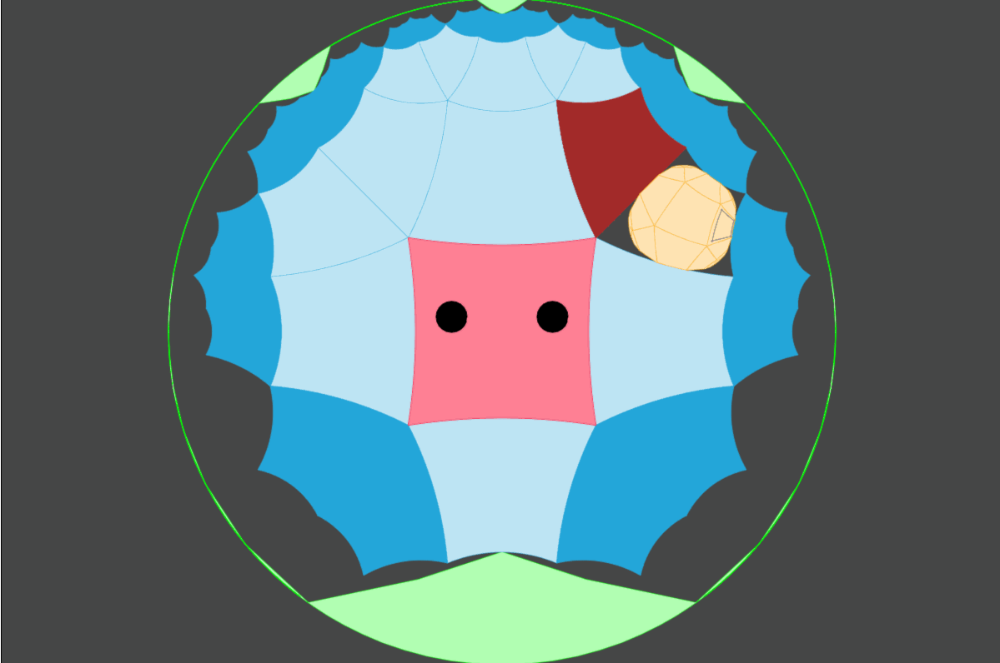

# Patrick's Hyperbox

[Patrick's Parabox](https://patricksparabox.com) is a fun block-pushing puzzle game of boxes in boxes in boxes, but it takes place in normal parabolic geometry (Euclidean geometry). Patrick's **Hyper**box takes the concept further, into hyperbolic space!

Try it at https://kevinychen.github.io/patricks-hyperbox/.

## How to use

**This repository is still a work in progress.**

Simply clone the repository and open `index.html` in the browser.

